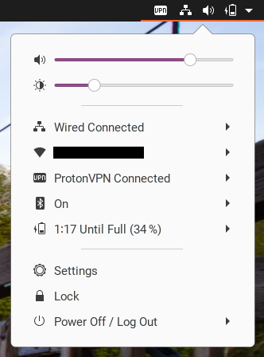

# Unofficial ProtonVPN Status

 

A GNOME extension for controlling and monitoring your ProtonVPN connection through the GNOME DE.

## **IMPORTANT FOR THIS EXTENSION TO WORK**

[**You need to follow this official guide by the ProtonVPN team inorder to allow this extension to handle the ProtonVPN linux-cli client without superuser privilages.**](https://github.com/ProtonVPN/linux-cli/blob/master/USAGE.md#disable-sudo-password-query)

## How to Install This Extension

This extension uses the ProtonVPN linux-cli tool. You will need to install it before using this extension. Please follow ProtonVPN's installation guide for your current distribution:

<https://protonvpn.com/support/linux-vpn-tool/>

Once you've done that, install and enable the extension on GNOME Extensions:

[][ego]

[ego]: https://extensions.gnome.org/extension/3133/protonvpn-status/

## What This Extension Offers

If you want to interact with ProtonVPN the same way the network-manager handles OpenVPN, this is the extension for you.

This extension offers a drop-down item in the user menu which will simply allow you to connect/disconnect from ProtonVPN. You will be notified when the extension starts connecting or disconnecting using the ProtonVPN linux-cli client.

### Planned Features

<!--  -->
|Additional Features|Feature Implemented|
|:-----|:-----:|
|Add notification to indicate connection status||
|Add server details to notification||
|Offer GUI for changing ProtonVPN linux-cli client settings||
|Change VPN notification icon to ProtonVPN mark||

### Compatibility

This extension has been tested with GNOME 3.36.

### Credits

This extension is developed and maintained by [@ceiphr](https://github.com/ceiphr).

Significant portion of code in this extension were derived from [@bajcmartinez](https://github.com/bajcmartinez)'s [NordVPN-Status](https://github.com/bajcmartinez/nordvpn-status).

The ProtonVPN logo and mark are both registered trademarks of Proton Technologies AG. 

The GNOME foot logo is a registered trademark of The GNOME Foundation.

The [checkmark icon](https://icons8.com/icons/set/checkmark) used in "Planned Features" was created by [Icons8](https://icons8.com).

### License & Terms 
ProtonVPN Status is available under the [GNU GENERAL PUBLIC LICENSE v3.0](LICENSE).

### Disclaimer

ProtonVPN is a product of Proton Technologies AG. I, [Ari Birnbaum](https://www.ceiphr.com/), am in no way affiliated with ProtonVPN, the ProtonVPN team, or Proton Technologies AG. Please determine if your issue pertains to this extension or to ProtonVPN's linux-cli client before reporting it.

GNOME is a project of The GNOME Foundation. I, [Ari Birnbaum](https://www.ceiphr.com/), am in no way affiliated with GNOME or The GNOME Foundation.

Thank you for using the extension. I really appreciate it.
